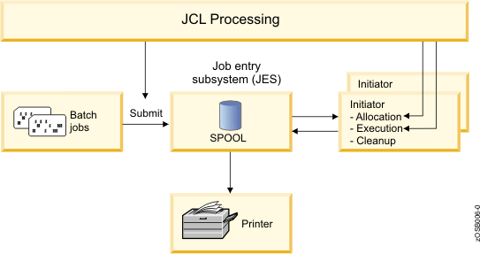

# Batch

* A program designed to run without further user interaction
* Many "Hello World!" examples are a batch process with [12 examples](https://towardsdatascience.com/how-to-print-hello-world-in-top-12-most-popular-programming-languages-736d49c6c61c)
* Often a batch is configured to run automatically at a certain times: cronjob and scheduled task
* The term originated with mainframe computers and punched cards
* E.g.: end of day banking is a batch process of consolidating and counting cash
* Reports are often produced in a batch-like manner

