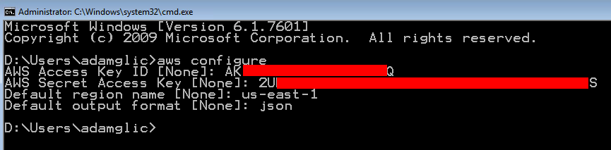

# CLI: Command Line Interface

* A command line program that accepts text input to execute operating system functions
* Such access was primarily provided to users by computer terminals starting in [the mid-1960s](https://en.wikipedia.org/wiki/Command-line_interface)
* Today programming and maintenance tasks may use a command line, e.g. [AWS CLI](https://aws.amazon.com/cli/) or [Angular CLI](https://cli.angular.io/)
* *nix Shell and Windows Powershell are widely used to configure and to maintain operating system themselves
* The difference between a batch and a CLI is that cli may ask for an input from the user via [teletypewriter](https://www.howtogeek.com/428174/what-is-a-tty-on-linux-and-how-to-use-the-tty-command/) (tty)
* Batch processes, typically, receive their input via command line arguments or from configuration files

