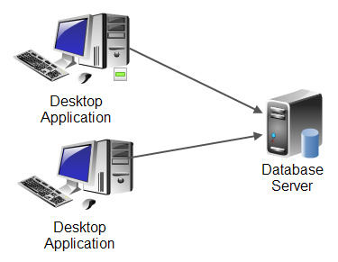

# Client-Server Application

* The first distributed application model we cover
* Typically, an application partitions workloads between end-user desktop and a server over the network
* Ideally, the desktop would be responsible for user-interface rendering and the server for business logic and storage
* More commonly, [fat client](https://whatis.techtarget.com/definition/fat-client-thick-client) have been build with lots of functionality and logic running on the desktop
* Server, often is a database or another form of shared storage only
* Common troubles with client-server is high-cost of upgrades/distribution/maintenance
* Praised for native look-and-feel and ability to operate in a disconnected mode
* Microsoft Desktop Outlook is a client-server application

