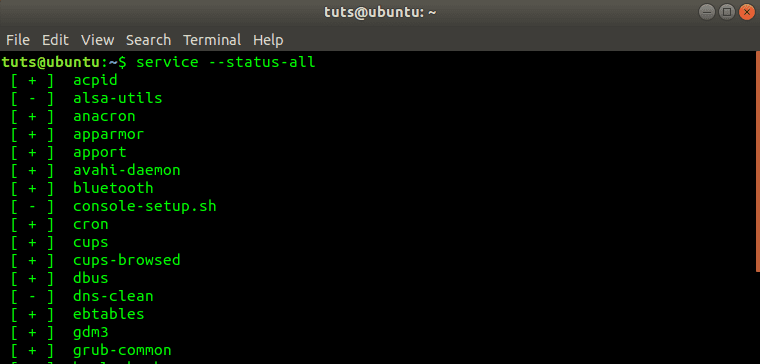

# Daemon or Service

* Daemon: a computer program that runs as a background process
* Service: formally, a program which responds to requests from other programs
* More commonly service is a reference to Windows Service analogous to *nix Daemon
* On *nix the process name of a daemon ends with the letter d, e.g.: `sshd` for OpenSSH Daemon
* On Windows process name may carry a `Service` suffix
* Daemon/service cannot expect any input/output from/to a user
* Daemon/Service implements start, stop, restart actions, and provides status to the S
* Operating Systems provide terminal commands and GUI to list and to control daemons/services

