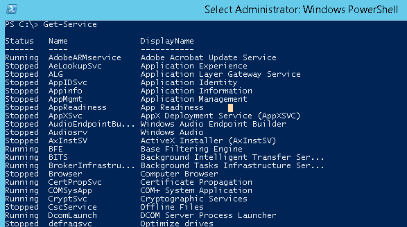

# Daemon or Service

* Daemon: a computer program that runs as a background process
* Service: formally, a program which responds to requests from other programs
* More commonly service is a reference to Windows Service analogous to *nix Daemon
* On *nix the process name of a daemon ends with the letter d, e.g.: `sshd` for OpenSSH Daemon
* On Windows process name may carry a `Service` suffix
* Daemon/Service runs under a root/system user or a less privileged identity
* Operating Systems provide command line and GUI to list daemons/services

 <table border="0pxl">
  <tr>
    <td>
      
    </td>
    <td>
       
    </td>
  </tr>
</table>
