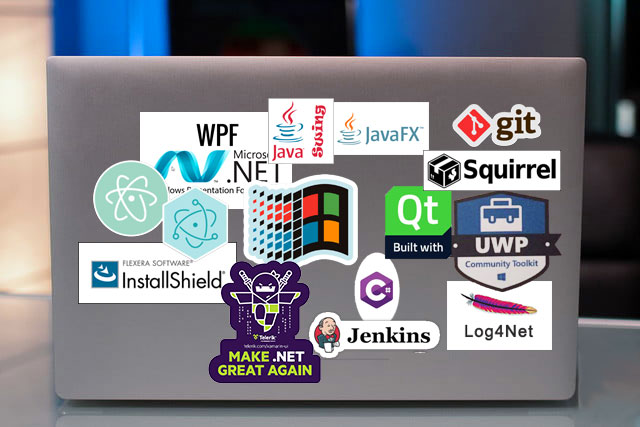

# Desktop GUI: Graphical User Interface

* Linux, Mac and Windows Applications running locally on a user computer with graphical interaction model, e.g. Microsoft Word
* In 1979, the Xerox Palo Alto Research Center developed the first prototype for a GUI
* Steve Jobs, looking for new ideas, traded US $1 million in stock options to Xerox for a detailed tour of their facilities
* Apple engineers developed Lisa, the first GUI-based computer available to the public
* In 1984 and billed as "insanely great," the Macintosh caught the public eye 
* Windows copied the conceptual framework of the Macintosh GUI
* X-Window System is a common on *nix operating systems
* C/C++, C#, Java, Python, NodeJs and other programming languages can be used to build
* Multiple frameworks are available: Windows Forms, Qt, Swing, and [counting](https://www.slant.co/topics/983/~best-cross-platform-gui-toolkits)
* Some are cross-platform and some are platform-specific

