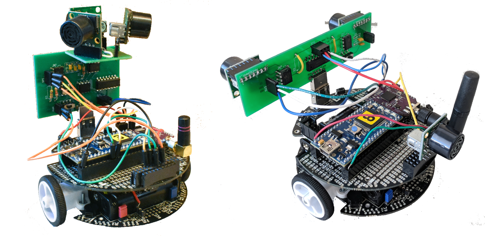

# IoT & Robotic

* IoT: network of physical “things” embedded with sensors and software exchanging data with other devices and systems over a network
* Robotic: systems that provide services and information by interacting with their environment via the use of various sensors and actuators
* IoT and Robotic development can be done with a number of programming languages, [most popular](https://www.analyticsinsight.net/top-internet-of-things-programming-languages-of-2020/): Java, C/C++, JavaScript, and Python
* A number of IoT platforms for end-to-end IoT implementation is available, e.g. IBM Watson, AWS/Azure/Google IoT
* [ROS](https://www.ros.org/) is frequently comes to mind as a robotic platform, AWS offers [RoboMaker](https://aws.amazon.com/robomaker/) service
* Unattended operation, software upgrades, orchestration and security are common IT challenges with IoT and Robotic solutions

