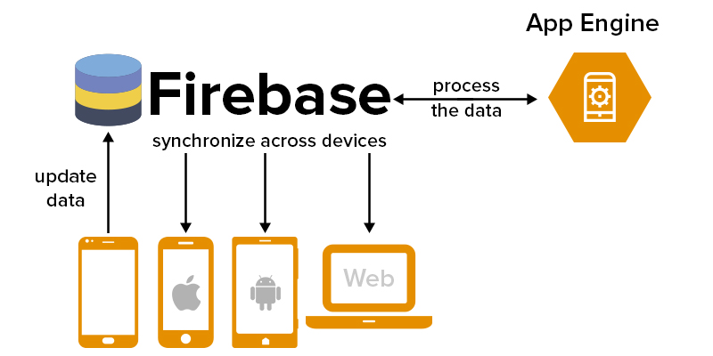

# Mobile App

* A software application designed to run on a mobile device such as a phone, tablet, or watch
* Generally downloaded from application distribution platforms e.g.: App Store and Google Play
* In enterprise environments applications can be distributed using [Enterprise App Store](https://www.g2.com/categories/enterprise-app-store)
* Some mobile app required no network connectivity and run entirely on a device
* More commonly, mobile app will leverage a device capability e.g. location services and will access server side services e.g.: Twitter feed
* Platform-native SDK: iOS SDK and Android SDK
* Cross platform SDK: Xamarin, react-native, Flutter, Adobe PhoneGap, Ionic, and counting
* Benefits of native SDK's: native look-and-feel, responsiveness and access to the latest features
* Advantages of cross-platform SDK's: lower cost and consistent look-and-feel across platforms
* Public Cloud providers offer services for mobile application back-ends, e.g. [Google Firebase](https://cloud.google.com/solutions/mobile/mobile-app-backend-services)

