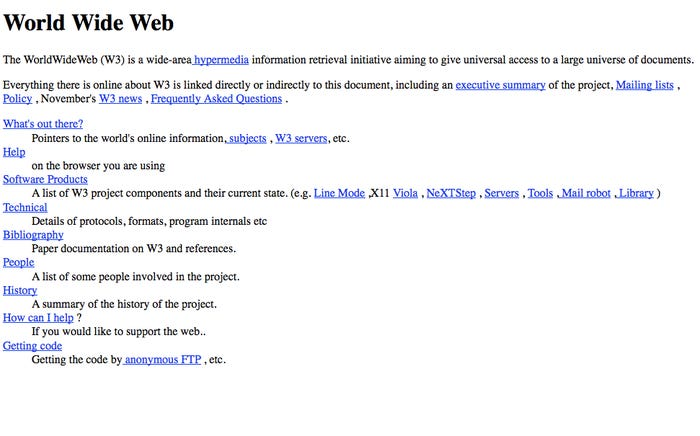

# Web Based GUI

* Strictly speaking: any program that is accessed over a network connection using http(s) protocol
* More commonly a web browser graphical user interface as a next step to static web sites from mid-90's
* Mostly associated with html/css/javascript technologies
* Alternatives to that: deprecated [Java Applet](https://en.wikipedia.org/wiki/Java_applet), deprecated [Silverlight](https://www.microsoft.com/silverlight/), and evolving [Web Assembly](https://webassembly.org/)
* Html used to be generated on the server, most commonly, using [Model-View-Controller](https://en.wikipedia.org/wiki/Model%E2%80%93view%E2%80%93controller) architecture
* Nowadays, html is generated in the browser using [SPA](https://en.wikipedia.org/wiki/Single-page_application) frameworks: [Angular](https://angular.io/), [ReactJs](https://reactjs.org/), [Vue](https://vuejs.org/), and [more](https://www.educba.com/angular-alternatives/)
* There is also a hybrid or isomorphic approach where html is rendered by the server and by the browser e.g. [meteor](https://www.meteor.com/)

