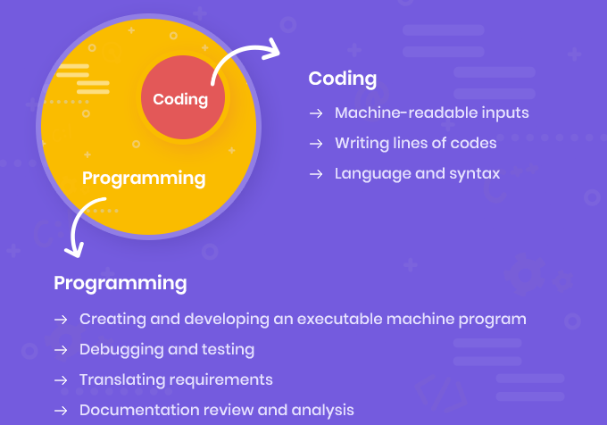

# From Coding to Programming

* Coding is the translation of natural language into machine commands
* Coders typically use an high-level programming language
* Coding requires skills of syntax, main keywords, and the basic logic of chosen language
* Coding is a big part of software development and is not the most important part
* Development includes planning, design, debugging, testing, deployment and maintenance of software
* Coding is accounted [for less than 50%](https://thenewstack.io/how-much-time-do-developers-spend-actually-writing-code/) of programmers time

