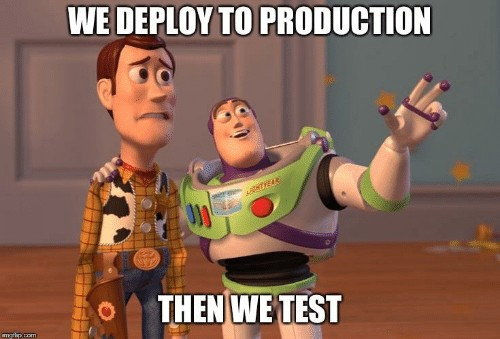

# Production

* Change management: tracking and managing changes to artifacts, such as code and requirements
* Deployment methods: recreate, rolling-update, blue/green, canary, A/B testing
* Logging: record events that occurs and aggregate the information
* Monitoring: performance and errors detection, notifications, outage and threats identification
* Disaster recovery: recovery time and recovery point objectives 

]
