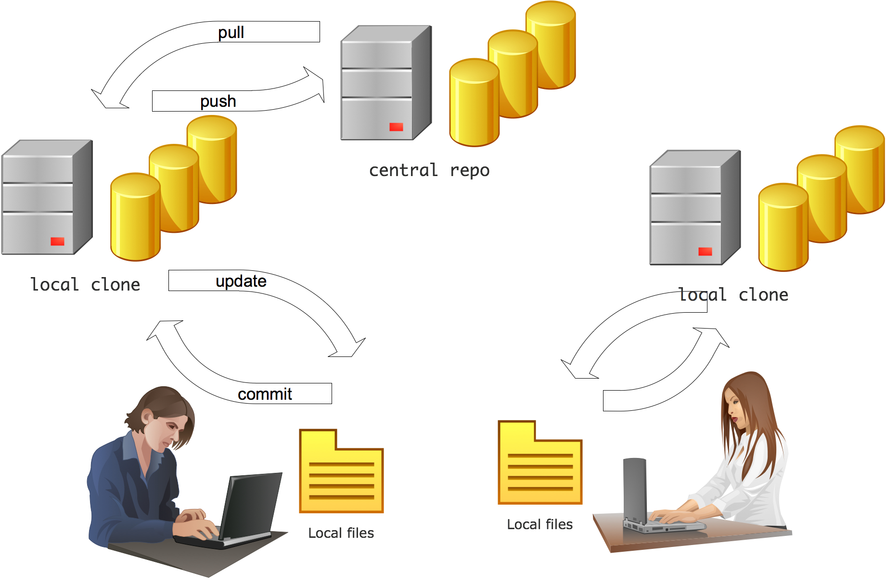

# Source Control Management

* Manages changes to source code, documents, large web sites, and other information
* Used by development teams to store, to share source code, and to track changes
* Changes identified by a number and/or letter code: `revision number`, `revision level`, `version`
* Today is used to manage Infrastructure-as-Code or IaC and CI/CD pipelines as well
* Distributed vs. centralized
* Popular SCM: git, CVS, SVN, Mercurial, and TFS/VSTS

