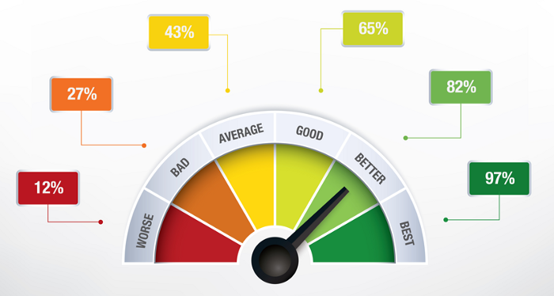

# Testing Methods Cont'd

## Non-Functional Testing

* Performance testing: determine how application behaves under load
* Security testing: determine if the information and data in a system is protected
* Usability testing: measure an application’s ease-of-use from the end-user perspective
* Compatibility testing: gauge how an application will work in different environments

