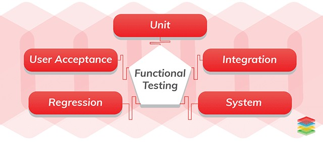

# Testing Methods

## Functional Testing

* Unit testing: testing individual unite of source code, e.g.: a function
* Integration testing: individual software modules are combined and tested as a group
* System testing: the application as a whole tested for compliance with requirements
* Acceptance testing: a test to determine whether the requirements are met
* Regression testing: validate that previously developed software still performs after a change

